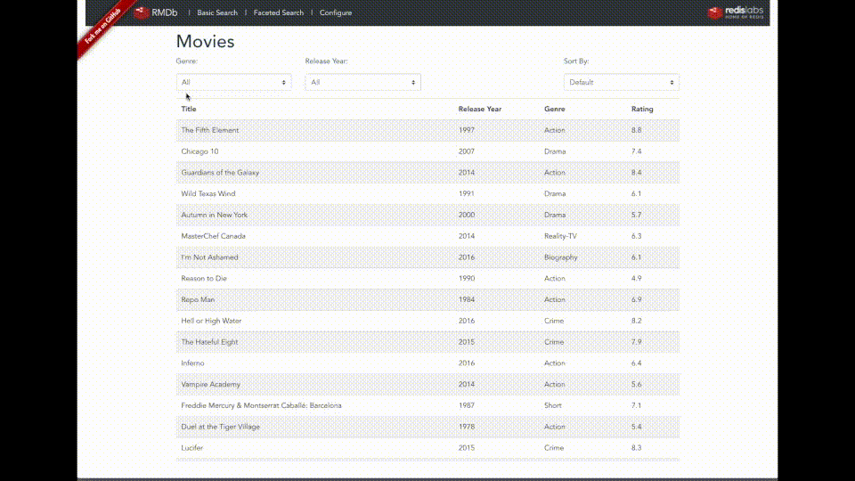

# Serverless Development with Redis Cloud and AWS Lambda

### About
This is demo of a movie discovery application using the [Redis Enterprise Cloud](https://redislabs.com/) and the [Serverless Architecture](https://en.wikipedia.org/wiki/Serverless_computing) on Amazon Web Services (AWS) using the [AWS lambda](https://aws.amazon.com/lambda/) for serverless compute.

## Pre-requisite:

- Redis Enterprise Cloud Essential Subscription
- AWS Accunt and Credentials (AWS_ACCESS_KEY_ID and AWS_SECRET_ACCESS_KEY)

### Features:

The application is made of 3 components:

* Movies service: Node.js Lambda functions to list, update and aggregate Movie catalog stord in Redis Hashes
* Comments service: Python Lambda functions to create, delete and list comments. To associate comments to a movie, the application use hash fields `movie_id` too filter and the field `timestamp` to sort them, this query is done with RediSearch query capabilities.
* Frontend application built using Vuew.js that call the movies and comments lambda functions.

## High Level Architectural Diagram

   
## Setup
1. [Deploying the Movies List Microservice](./movies-list-microservice/README.md)
1. [Deploying the Movies Comments Microservice](./movie-comments-microservice/README.md)
1. [Deploying the Frontend Code](./front-end/README.md) *(Optional)*

