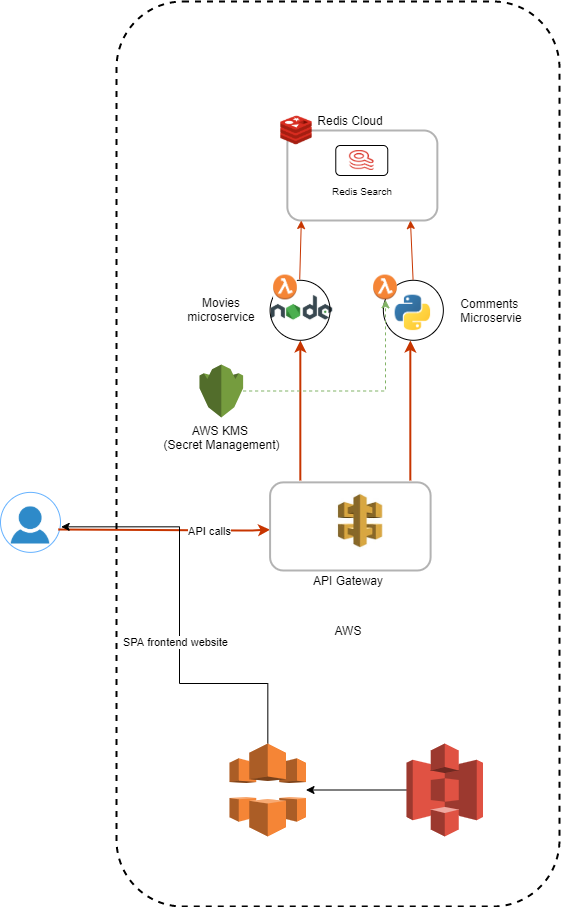

# A Demo App using Redis Enterprise Cloud with AWS Services

## High Level Requirements:

- Create a microservice based application using multiple AWS Services (Lambda, Kinesis, Athena, ...).
- Developer should be able to:
   - Get the code from Github
   - Create one more database on Redis Cloud with module(s)
   - Deploy and run the application.

- The application focuses on development and highlight the benefits of Redis Cloud.
- Two microservices, one with Python and one with Typescript

## High Level Architectural Diagram

### List of Functionalities

- Movie List, Search, Agreegation/Sorting using 
- Adding, Deleting Comments to a movie
- Movie comments search

## Phase #1
- Leveraging RediSearch
- Implement RedisSearch demo connected to AWS using Typescript 

<tbd>
   
## Setup
1. [Deploying the Frontend Code](./front-end/README.md)
2. [Deploying the Movies List Microservice](./movies-list-microservice/README.md)
2. [Deploying the Movies Comments Microservice](./movie-comments-microservice/README.md)

## Pre-requisite:

- Redis Enterprise Cloud Essential Subscription
- AWS Accunt and Credentials (AWS_ACCESS_KEY_ID and AWS_SECRET_ACCESS_KEY)
