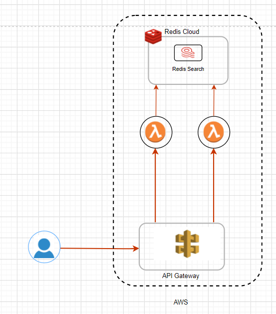

# A Demo App using Redis Enterprise Cloud with AWS Services

## High Level Requirements:

- Create a microservice based application using multiple AWS Services (Lambda, Kinesis, Athena, ...).
- Developer should be able to:
   - Get the code from Github
   - Create one more database on Redis Cloud with module(s)
   - Deploy and run the application.

- The application focuses on development and highlight the benefits of Redis Cloud.
- Two microservices, one with Python and one with Typescript

## High Level Architectural Diagram

### List of Functionalities

-  User Registration
-  Merchant Search
-  Paying Money to merchants
-  Merchant Suggestion based on previous transaction history
-  CRON lambda to process payments
-  User profile

## Phase #1
- Leveraging RediSearch
- Implement RedisSearch demo connected to AWS using Typescript 

<tbd>

## Pre-requisite:

- Redis Enterprise Cloud Essential Subscription
- AWS Accunt and Credentials (AWS_ACCESS_KEY_ID and AWS_SECRET_ACCESS_KEY)
