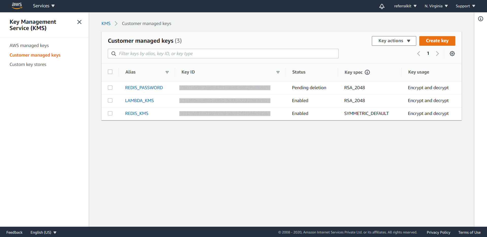
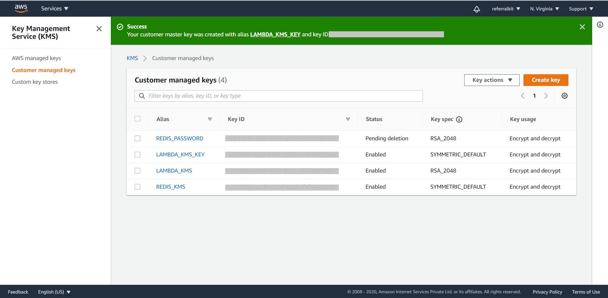

# Movie Comments Microservice

Implements CRUD operation using [Redis Enterprise Cloud](https://redislabs.com/#signup-modal) and the [AWS Chalice framework](https://aws.github.io/chalice/quickstart.html).


### Pre Requisites
- Python 
- AWS account & Credentials Setup

### Create a virtual environment:
```
python3 -m venv chalice-env
```
### Activate Virtual Env
```
source chalice-env/bin/activate
```

### Install requirements:
```
pip install -r requirements.txt
```

### Setup AWS
```
aws configure
```

Follow command prompt, output should be something like:
```
AWS Access Key ID [None]: ****************ABCD
AWS Secret Access Key [None]: ****************abCd
Default region name [None]: us-west-2
Default output format [None]:
```


### Setup Redis Data

When you have imported the data from the node.js project using the `import_movies.redis` an index named `idx:comments:movies` has been created to allow query on comments hashes. The following command was usesd to create the index:

```
  FT.CREATE idx:comments:movies on HASH PREFIX 1 'comments:' SCHEMA movie_id TAG SORTABLE user_id TEXT SORTABLE comment TEXT WEIGHT 1.0 timestamp NUMERIC SORTABLE rating NUMERIC SORTABLE
```

Go to the file: `.chalice/config.json` and paste your Redis Cloud config here:

    ```
    {
      "version": "2.0",
      "app_name": "movie-comments-microservice",
      "stages": {
        "dev": {
          "api_gateway_stage": "api",
          "environment_variables": {
            "REDIS_HOST": "<CHANGE-TO-REDISCLOUD-DB-HOST>.cloud.redislabs.com",
            "REDIS_PORT": "<CHANGE-TO-REDISCLOUD-DB-PORT>",
            "REDIS_PASSWORD": "<CHANGE-TO-REDISCLOUD-DB-PASSWORD OR EMPTY STRING FOR KMS>",
            "REDIS_KMS_PASSWORD": ""
          }
        }
      }
    }
    ```
Keep the `REDIS_KMS_PASSWORD` empty. This property is used when using AWS Key Management Service (KMS) to store an encrypted version of the password. You will see that in a later section.

## Deploying to the AWS
1. Activate Virtual Env
```
source chalice-env/bin/activate
```
2. Execute Chalice Deploy command
```
chalice deploy
```
You should get a response like this:
```

Reusing existing deployment package.
Updating policy for IAM role: movie-comments-microservice-dev
Creating lambda function: movie-comments-microservice-dev
Creating Rest API
Resources deployed:
  - Lambda ARN: arn:aws:lambda:us-east-1:11111111111:function:movie-comments-microservice-dev
  - Rest API URL: https://XXXXXXX.execute-api.us-east-1.amazonaws.com/api/
```

## Running locally
```
source chalice-env/bin/activate
chalice local
```


## Setting up KMS

The Comments Python function is using the password stored in clear in the configuration file `.chalice/config.json`.

[ASW KMS (Key Management Service)](https://docs.aws.amazon.com/kms/) allows user to store and ecnrypt data in the cloud.

In the following steps, you will learn how to create a new KMS key to encrypt and store the Redis Cloud database password.


1. Go to: https://console.aws.amazon.com/kms/home

2. Click on Customer Managed Keys and then click on create key button on the top right.



3. Select the following options:  
a. Key Type: Symmetric  
b. Key Material Origin: KMS  <br/> <br/>

click next, fill in the following options:  
a. Create alias and description: LAMBDA_KMS_KEY  
b. Tags: (skip)  <br/> <br/>

click next, fill in the following options:  
Key administrators: Appropriate Admin as per requirements
Key deletion: Yes <br/> <br/>


click next and then click finish


4. Go to the KMS console in customer managed keys, u will see the newly created key with the specified key alias. 



5. Copy the KEY ID against that alias

6. Run the following command:
```
aws kms encrypt --key-id YOUR_KEY_ID --plaintext YOUR_REDIS_LAB_PASSWORD --output text --query CiphertextBlob
```
7. You will get an out put like this please note the output
`AQICAHjyHd7fXfe0n6U2QqR0uzjM+Wwu*******************************************************RxV0Z/2dYgHIrV90mEkaTypmP8qaE=`

8. Go to the file: `.chalice/config.json` and paste your Redis Cloud config here:

Copy the value you have generated in the `REDIS_KMS_PASSWORD` value in the config file, and set the `REDIS_PASSWORD` to an empty string. 

    ```
    {
      "version": "2.0",
      "app_name": "movie-comments-microservice",
      "stages": {
        "dev": {
          "api_gateway_stage": "api",
          "environment_variables": {
            "REDIS_HOST": "<CHANGE-TO-REDISCLOUD-DB-HOST>.cloud.redislabs.com",
            "REDIS_PORT": "<CHANGE-TO-REDISCLOUD-DB-PORT>",
            "REDIS_PASSWORD": "",
            "REDIS_KMS_PASSWORD": "<CHANGE-TO-REDISCLOUD-DB-PASSWORDKMS-OPTIONAL>"
          }
        }
      }
    }
    ```
