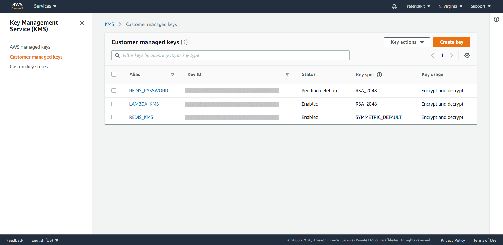
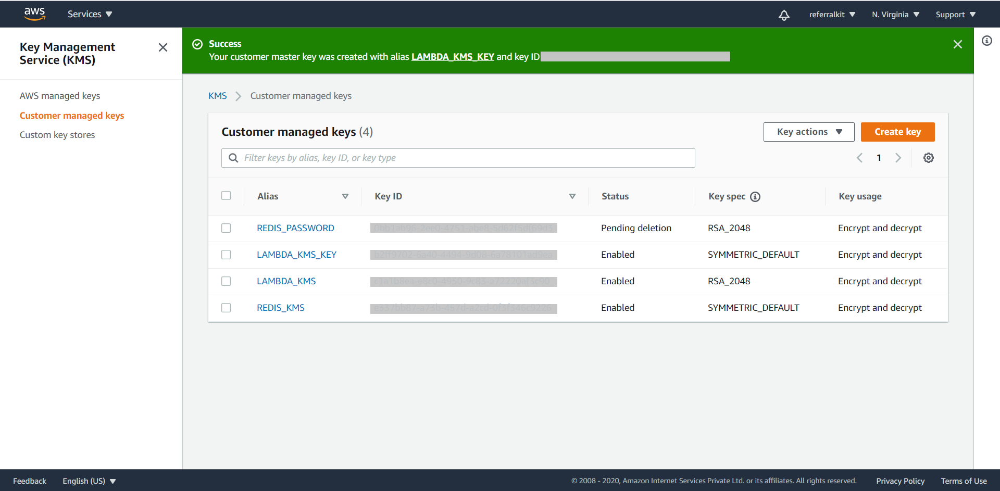

# Movie Comments Microservice

### About the service
Implements CRUD operation using [Redis Enterprise Cloud](https://redislabs.com/#signup-modal) and the [AWS Chalice framework](https://aws.github.io/chalice/quickstart.html).


### Create a virtual environment:
```
python3 -m venv chalice-env
```
### Activate Virtual Env
```
source chalice-env/bin/activate
```
### Install requirements:
```
pip install -r requirements.txt
```

### Setup AWS
```
aws configure
```
Follow command prompt, output should be something like:
```
AWS Access Key ID [None]: ****************ABCD
AWS Secret Access Key [None]: ****************abCd
Default region name [None]: us-west-2
Default output format [None]:
```

Setting up KMS:
1. Go to: https://console.aws.amazon.com/kms/home


2. Click on Customer Managed Keys and then click on create key button on the top right.



3. Select the following options:  
a. Key Type: Symmetric  
b. Key Material Origin: KMS  <br/> <br/>


click next, fill in the following options:  
a. Create alias and description: LAMBDA_KMS_KEY  
b. Tags: (skip)  <br/> <br/>


click next, fill in the following options:  
Key administrators: Appropriate Admin as per requirements
Key deletion: Yes <br/> <br/>


click next and then click finish


4. Go to the KMS console in customer managed keys, u will see the newly created key with the specified key alias. 



5. Copy the KEY ID against that alias

6. Run the following command:
```
aws kms encrypt --key-id YOUR_KEY_ID --plaintext YOUR_REDIS_LAB_PASSWORD --output text --query CiphertextBlob
```
7. You will get an out put like this please note the output
`AQICAHjyHd7fXfe0n6U2QqR0uzjM+Wwu*******************************************************RxV0Z/2dYgHIrV90mEkaTypmP8qaE=`
8. Go to the file: `.chalice/config.json` and paste your Redis Cloud config here:

```
    "dev": {
      "api_gateway_stage": "api",
      ...
      "environment_variables": {
        "REDIS_HOST": "",
        "REDIS_PORT": "",
        "REDIS_PASSWORD": "Secret noted in step 7"
      }
    }
```
### Setup Redis Data
- It is expected that you have already imported the movies data set
- For this microservice to function properly, we will need to create an index over the comments:
```
FT.CREATE ms:search:index:comments:movies on HASH PREFIX 1 'ms:comments:' SCHEMA movie_id TEXT SORTABLE user_id TEXT SORTABLE comment TEXT WEIGHT 1.0 timestamp NUMERIC SORTABLE rating NUMERIC SORTABLE
```
1. We create a RediSearch index `ms:search:index:comments:movies` specifying schema based on the entities we want to search.


## Deploying to the AWS
1. Activate Virtual Env
```
source chalice-env/bin/activate
```
2. Execute Chalice Deploy command
```
chalice deploy
```

## Running locally
```
source chalice-env/bin/activate
chalice local
```


SCRATCH:


2. chalice, why?
3. chalice deployment guide 
4. 


Run:
```
source ../.chalice-env/bin/activate
```


```
FT.CREATE ms:search:index:comments:movies on HASH PREFIX 1 'ms:comments:' SCHEMA movie_id TEXT SORTABLE user_id TEXT SORTABLE comment TEXT WEIGHT 1.0 timestamp NUMERIC SORTABLE rating NUMERIC SORTABLE
```

